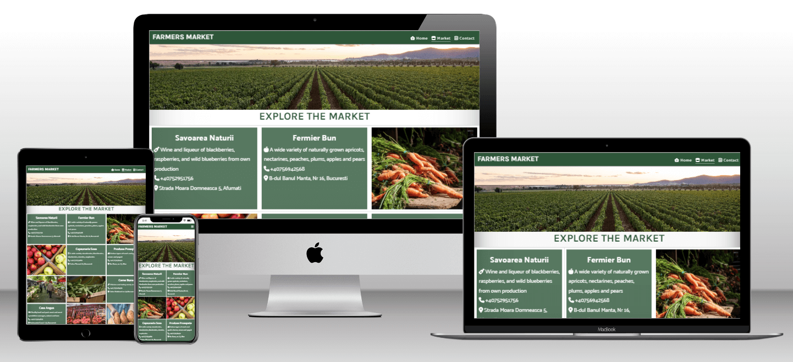

# Farmers Market

## Overview
Farmers Market is a website dedicated to connecting local farmers with nearby consumers, providing access to fresh and cost-effective agricultural products. The landing page highlights the positive impact of supporting local farmers on both the community and the economy. The website also features a contact form with an option for new farmers to express interest and join the platform.

## Features

### Existing Features

- __Navigation Bar__
  
  - The responsive navigation bar is featured on all pages, offering easy access to the landing page, market, and contact page.
  - This feature enables users to effortlessly move between pages on any device, eliminating the need to use the 'back' button to return to the previous page.

- __Landing Page Image__
  
  - The landing page incorporates an image with overlaid text, providing users a direct view of the project's core values, which focus on enhancing both individual health and community well-being. 
 
  - Together the image and the text convey the message that such exchanges contribute to individual well-being and enhance community health.

- __Values__
  
  - This section emphasizes the positive impact of local farmers on the community and economy, fostering awareness and appreciation for their vital role in shaping the local landscape.
  
  - Additionally, it encourages users to support and engage with local farmers through compelling content and messaging, aiming to motivate participation in activities that strengthen the bond between consumers and the agricultural community.

- __The Footer__

  - The footer of the page features links to Farmers Market associated social media platforms, which open in new tabs for user-friendly navigation.
  
  - This section is beneficial for users, promoting connection and engagement through social media.

-__Contact Form__

The contact form provides a convenient way for users to get in touch. It includes a special option for new farmers to express interest and join the platform by clicking an additional box.

## Features Left to Implement
.........

## Testing
..........

## Validator Testing:

HTML: Passed W3C validator with no errors.
CSS: Passed Jigsaw validator with no errors.
Browsers and Screen Sizes:

The website was tested on various browsers and screen sizes to ensure a consistent and user-friendly experience.
Unfixed Bugs:

No major bugs were left unfixed. Any minor issues or limitations are detailed here.

## Deployment
The Farmers Market website is deployed on GitHub Pages. To deploy the site:

Navigate to the Settings tab in the GitHub repository.
From the source section drop-down menu, select the Master Branch.

## Credits

## Content
Content on the landing page created with a focus on local farmers' benefits for the community and economy.
.....................................

## Media
Images and visual elements sourced from Open Source repositories.

Icons in the footer taken from Font Awesome.
