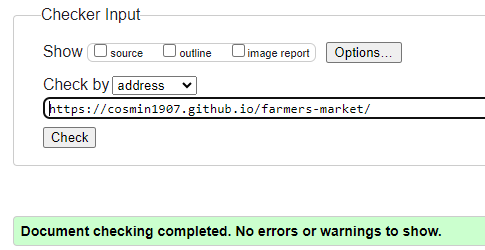

# Farmers Market

## Overview

Farmers Market is a website dedicated to connecting local farmers with nearby consumers, providing access to fresh and cost-effective agricultural products. The landing page highlights the positive impact of supporting local farmers on both the community and the economy. The website also features a contact form with an option for new farmers to express interest and join the platform. View the live site [here](https://cosmin1907.github.io/farmers-market/)


## Features

- __Navigation Bar__
  
  - The responsive navigation bar is featured on all pages, offering easy access to the landing page, market, and contact page.
  - This feature enables users to effortlessly move between pages on any device, eliminating the need to use the 'back' button to return to the previous page.


- __The Footer__

  - The footer of the page features links to Farmers Market associated social media platforms, which open in new tabs for user-friendly navigation.
  
  - This section is beneficial for users, promoting connection and engagement through social media.


## Landing Page

- __Landing Page Image__
  
  - The landing page incorporates an image with overlaid text, providing users a direct view of the project's core values, which focus on enhancing both individual health and community well-being.
  
  - Together the image and the text convey the message that such exchanges contribute to individual well-being and enhance community health.


- __Values__
  
  - This section emphasizes the positive impact of local farmers on the community and economy, fostering awareness and appreciation for their vital role in shaping the local landscape.
  
  - Additionally, it encourages users to support and engage with local farmers through compelling content and messaging, aiming to motivate participation in activities that strengthen the bond between consumers and the agricultural community.


## Market Page

- __Main Purpose__

  - This page is designed to connect consumers with farmers, offering a direct line to the source of fresh produce and artisanal goods.
  - It features a thematic hero image of a cultivated field, emphasizing its focus on a farmers market.
  

  
- __Main Features__
  
  - Farmers' contact phone numbers and addresses are prominently displayed, facilitating direct communication between consumers and producers.
  - The photos provide a snapshot of the diverse products available. Images and text seamlessly blend for an engaging browsing experience.
  


## Contact Page

- __Main Purpose__
  
  - The contact page provides a convenient way for users to get in touch trough the contact form.
  

  
- __Aditional Features__
  - A dedicated checkbox option has been implemented to reveal previously hidden fields, enabling new farmers to express interest and join the platform.
  - The additional fields require users to provide both direct contact information and detailed product descriptions.
  - Upon successful submission of the contact form, users will be directed to a dedicated thank-you page, confirming the successful submission and suggesting that our team will promptly review it.


## Features Left to Implement

Create a JavaScript functionality that enables sending an email to the website owner when a new message is submitted through the contact form.

## Design

### Wireframes

Home Page


Market Page


Contact page


Thank You Page


## Testing

### Responsivness

- __Testing Criteria__

Conducted testing on all pages for responsiveness across screen sizes from 320px upwards, following [WCAG 2.1 Reflow criteria for responsive design](https://www.w3.org/WAI/WCAG21/Understanding/reflow.html)
Utilized Chrome, Edge, Firefox, and Opera browsers.

- __Steps to Test__

Opened the browser and navigated to [Farmers Market](https://cosmin1907.github.io/farmers-market/).
Opened developer tools and set to responsive mode.
Decreased width to 320px, set zoom to 50%, and clicked/dragged the responsive window to maximum width.
testede phone numbers

- __Expected__

Website should be responsive on all screen sizes.
No pixelation or stretching of images.
No horizontal scroll.
No overlapping elements.

- __Actual__
???

- __Additional Device Testing__

Confirmed responsive design on the following devices:
Ipad Pro
iPhone SE

Overall, the website demonstrated responsive behavior as intended

### Accessibility

[Wave Accessibility](https://wave.webaim.org/) tool was used throughout development and for final testing of the deployed website to check for any aid accessibility testing.

Testing was focused to ensure the following criteria were met:

- All forms have associated labels or aria-labels so that this is read out on a screen reader to users who tab to form inputs
- Color contrasts meet a minimum ratio as specified in [WCAG 2.1 Contrast Guidelines](https://www.w3.org/WAI/WCAG21/Understanding/contrast-minimum.html)
- Heading levels are not missed or skipped to ensure the importance of content is relayed correctly to the end user
- All content is contained within landmarks to ensure ease of use for assistive technology, allowing the user to navigate by page regions
- All not textual content had alternative text or titles so descriptions are read out to screen readers
- HTML page lang attribute has been set
- Aria properties have been implemented correctly
- WCAG 2.1 Coding best practices being followed
  
  - Issue:
  - Fix:

### Functional Testing

- __Navigation__

Confirmed all navigation links lead to the correct pages.
Verified links on all pages, ensuring expected navigation.

- __Forms__

Tested the contact form for various scenarios.
Correct inputs led to successful submission and redirection.
Detected and displayed appropriate error messages for missing or incorrect inputs.

- __Footer__

Validated Social Media Icons: Confirmed they open in new tabs and display correct hover color.
Checked Footer Contact Information:
Tested phone number link, confirming it prompts the call option.
Tested email address link, confirming it opens the default email application.

In summary, comprehensive testing covered navigation, form functionality, and footer elements, ensuring a smooth user experience.

### Validator Testing

- HTML
  - No errors were returned when passing through the official [W3C validator](https://validator.w3.org)
  
  
  
  
  
- CSS
  - No errors were found when passing through the official [(Jigsaw) validator](https://jigsaw.w3.org)
  
  
  
### Lighthouse Testing


### Unfixed Bugs

No major bugs were left unfixed. Any minor issues or limitations are detailed here:

## Deployment

### Version Control

The site was created using Codeanywhere code editor and pushed to github to the repository ‘farmers-market’.

The following git commands were used throughout development to push code to the remote repo:

```git add <file>``` - This command was used to add the file(s) to the staging area before they are committed.

```git commit -m “commit message”``` - This command was used to commit changes to the local repository queue ready for the final step.

```git push``` - This command was used to push all committed code to the repository on github.

### Deployment to Github Pages

- The site was deployed to GitHub pages. The steps to deploy are as follows:
  - In the GitHub repository, navigate to the Settings tab
  - From the menu on left select 'Pages'
  - From the Build and deployment section, Branch sub section drop-down menu, select: main Click 'Save'
  - A live link will be displayed when published successfully.

The live link can be found here - <https://cosmin1907.github.io/farmers-market/>

### Clone the Repository Code Locally

Navigate to the GitHub Repository you want to clone to use locally:

- Click on the code drop down button
- Click on HTTPS
- Copy the repository link to the clipboard
- Open your IDE of choice (git must be installed for the next steps)
- Type git clone copied-git-url into the IDE terminal

The project will now of been cloned on your local machine for use.

## Credits

- __Media__
  - Images and visual elements sourced from Open Source repositories:
  
  - Icons from Font Awesome were utilized not only in the footer but also in other sections such as the navigation bar and in various places throughout the website to enhance user experience and visual elements.

- __Content__
  - The content developed for this website includes mock details and names for farmers to ensure privacy. This approach allows effective demonstration of the website's features while respecting the confidentiality of real individuals.