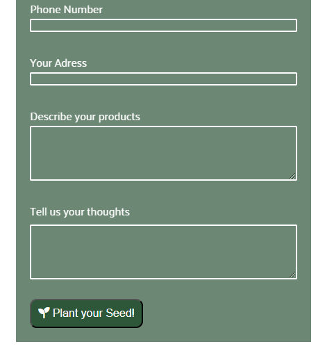

# Farmers Market

## Overview
Farmers Market is a website dedicated to connecting local farmers with nearby consumers, providing access to fresh and cost-effective agricultural products. The landing page highlights the positive impact of supporting local farmers on both the community and the economy. The website also features a contact form with an option for new farmers to express interest and join the platform. View the live site [here](https://cosmin1907.github.io/farmers-market/)


## Features

### Existing Features

- __Navigation Bar__
  
  - The responsive navigation bar is featured on all pages, offering easy access to the landing page, market, and contact page.
  - This feature enables users to effortlessly move between pages on any device, eliminating the need to use the 'back' button to return to the previous page.


- __Landing Page Image__
  
  - The landing page incorporates an image with overlaid text, providing users a direct view of the project's core values, which focus on enhancing both individual health and community well-being. 
 
  - Together the image and the text convey the message that such exchanges contribute to individual well-being and enhance community health.


- __Values__
  
  - This section emphasizes the positive impact of local farmers on the community and economy, fostering awareness and appreciation for their vital role in shaping the local landscape.
  
  - Additionally, it encourages users to support and engage with local farmers through compelling content and messaging, aiming to motivate participation in activities that strengthen the bond between consumers and the agricultural community.


- __The Footer__

  - The footer of the page features links to Farmers Market associated social media platforms, which open in new tabs for user-friendly navigation.
  
  - This section is beneficial for users, promoting connection and engagement through social media.


## Market Page

- __Main Purpose__

  - This page is designed to connect consumers with farmers, offering a direct line to the source of fresh produce and artisanal goods.
  -  It features a thematic hero image of a cultivated field, emphasizing its focus on a farmers market.
  

  
  - __Main Features__
  
    - Farmers' contact phone numbers and addresses are prominently displayed, facilitating direct communication between consumers and producers.
    - The photos provide a snapshot of the diverse products available. Images and text seamlessly blend for an engaging browsing experience.
  


  ## Contact Page

- __Main Purpose__
  
  - The contact page provides a convenient way for users to get in touch trough the contact form. 
  

  
- __Aditional Features__
  - A dedicated checkbox option has been implemented to reveal previously hidden fields, enabling new farmers to express interest and join the platform.
  - The additional fields require users to provide both direct contact information and detailed product descriptions.
  - Upon successful submission of the contact form, users will be directed to a dedicated thank-you page, confirming the successful submission and suggesting that our team will promptly review it.




## Features Left to Implement
.........

## Design

### Wireframes

Home Page


Market Page


Contact page


Thank You Page


## Testing

### Responsivness
### Accessibility
### Functional Testing

-__Validator Testing__

HTML: Passed W3C validator with no errors.
CSS: Passed Jigsaw validator with no errors.
Browsers and Screen Sizes:

The website was tested on various browsers and screen sizes to ensure a consistent and user-friendly experience.

### Unfixed Bugs:

No major bugs were left unfixed. Any minor issues or limitations are detailed here:


## Deployment

### Version Control

The site was created using Codeanywhere code editor and pushed to github to the repository ‘farmers-market’.

The following git commands were used throughout development to push code to the remote repo:

```git add <file>``` - This command was used to add the file(s) to the staging area before they are committed.

```git commit -m “commit message”``` - This command was used to commit changes to the local repository queue ready for the final step.

```git push``` - This command was used to push all committed code to the repository on github.

### Deployment to Github Pages

- The site was deployed to GitHub pages. The steps to deploy are as follows:
  - In the GitHub repository, navigate to the Settings tab
  - From the menu on left select 'Pages'
  - From the Build and deployment section, Branch sub section drop-down menu, select: main Click 'Save'
  - A live link will be displayed when published successfully.

The live link can be found here - <https://cosmin1907.github.io/farmers-market/>

### Clone the Repository Code Locally

Navigate to the GitHub Repository you want to clone to use locally:

- Click on the code drop down button
- Click on HTTPS
- Copy the repository link to the clipboard
- Open your IDE of choice (git must be installed for the next steps)
- Type git clone copied-git-url into the IDE terminal

The project will now of been cloned on your local machine for use.


## Credits

-__Media__
- Images and visual elements sourced from Open Source repositories.
- Icons in the footer taken from Font Awesome.

-__Content__

